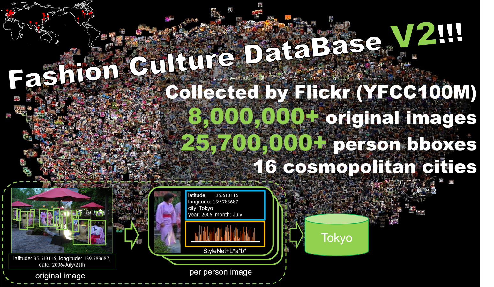

# FashionCultureDataBase v2 Downloader
## Fashion Culture DataBase v2 (FCDBv2)
[Fashion Culture DataBase v2 (FCDBv2)][1]は世界最大規模のファッションデータベースです。  
SNS (Flickr)に投稿された、世界を代表する16都市で撮影された人物画像を収集しました。  
オリジナル画像は2,822,421枚、人物の画像 (bbox数)は8,716,461枚と大規模です。  

## Use FCDBv2
FCDBv2はYFCC100Mを基に構築した画像データベースです。従ってライセンスやその他の権利はYFCC100Mに帰属します。  
従って、FCDBv2を使用するにはYFCC100Mの使用に必要な手続きなどが必要となります。  
詳しくは以下で説明するYFCC100Mのダウンロード方法または[YFCC100M][2]にてご確認ください。  

本レポジトリで共有するものは以下の通りです。  
* FCDBv2構築に必要な画像およびバウンディングボックスの一覧
* FCDBv2を自動で構築するためのスクリプト  
 画像のみの収集または物体検出のための保存形式 (Pascal VOC、MS COCO)
* YFCC100Mを使用するための簡単な手引き

## Download FCDBv2
以下の手順でFCDBv2をダウンロードすることができます。
### YFCC100Mのダウンロード
初めに、YFCC100Mをダウンロードする必要があります。ここでダウンロードするデータは画像ではなく、画像のURLやメタ情報が記述されたファイル"yfcc100m_dataset" (拡張子なし)です。  
YFCC100MはAmazon Web Services (AWS)でのみ公開されているため、使用するにはアカウントの登録や使用権の申請などが必要となります。  
以下の手順でアカウント作成からダウンロードまで可能ですが、契約やライセンスに関する内容は読み飛ばさず慎重に行ってください。  
※いかなる責任を負いません。  
※Amazon Web Servicesの登録は、試用期間に限り料金は発生しませんが、期間以降は登録したクレジットカード情報からの支払いが発生する可能性があります。

アカウント作成からダウンロードまでの手順  
※既に取得済みの方やアカウント登録済みの方など、適宜スキップして頂いて構いません。
1. Yahoo!アカウントの作成 (Yahoo! Japanアカウントは別です)
2. AWSアカウントの作成
3. Yahoo!データセット利用の申請
4. AWSにアクセスするための秘密鍵の生成
5. s3cmdをインストール
6. メタデータのダウンロード

上記の手順は、以下のQiitaの記事を参考にしております。  
[1億枚ラベル付き画像データセット Yahoo Flickr Creative Commons 100M (YFCC100M) を使う][3]

### スクリプトの実行
これをやってね！

## copywrite
国立開発研究法人産業技術総合研究所

[1]:https://arxiv.org/abs/1703.07920
[2]:http://projects.dfki.uni-kl.de/yfcc100m/
[3]:https://qiita.com/_akisato/items/66deb481ea3cedf388fa